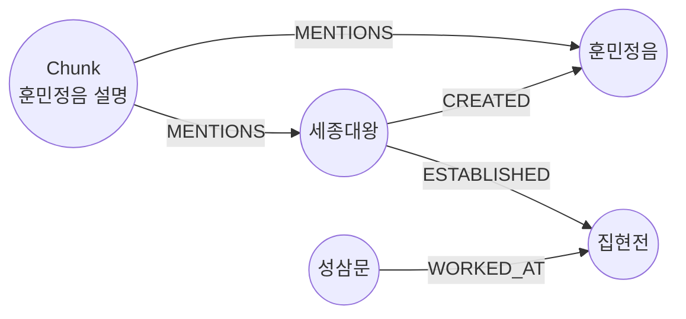
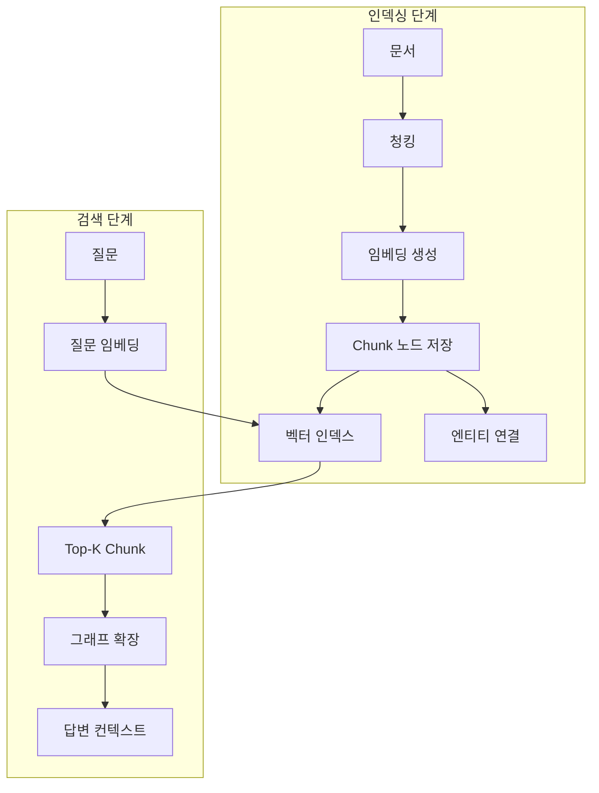

# 07-01. GraphRAG 아키텍처 이해

Source: <https://wikidocs.net/319223>

## 핵심 요약

GraphRAG 아키텍처는 세 층으로 나누어 보면 쉽습니다.

1. **텍스트 층**: 문서를 `Chunk`로 나누고 각 청크에 `embedding`을 저장합니다.
2. **그래프 층**: 사람, 기관, 업적 같은 엔티티와 관계를 Neo4j 그래프로 저장합니다.
3. **검색 층**: 질문에 맞춰 벡터 검색, 그래프 탐색, 또는 둘의 조합을 실행합니다.

## 컴포넌트별 역할

| 컴포넌트 | 저장/실행 위치 | 역할 |
| --- | --- | --- |
| `Chunk` 노드 | Neo4j | 검색 대상 텍스트 조각과 임베딩을 담습니다. |
| `embedding` 속성 | `Chunk` 노드 속성 | 의미 유사도 계산에 쓰는 숫자 배열입니다. |
| 엔티티 노드 | Neo4j | 세종대왕, 집현전, 훈민정음처럼 관계 탐색 대상이 되는 지식입니다. |
| `MENTIONS` 관계 | `Chunk -> Entity` | 어떤 청크가 어떤 엔티티를 언급하는지 연결합니다. |
| Retriever | Python 라이브러리 또는 직접 Cypher | 질문마다 관련 컨텍스트를 가져옵니다. |
| LLM | OpenAI 등 | 검색 결과를 바탕으로 자연어 답변을 생성합니다. |

**다이어그램: 텍스트 청크와 지식 그래프가 만나는 기본 구조입니다.**



## 인덱싱 단계와 검색 단계

GraphRAG는 크게 두 단계로 나뉩니다.

### 1. 인덱싱 단계

한 번 준비해 두는 작업입니다.

1. 원문 문서를 청크로 나눕니다.
2. 각 청크의 임베딩을 계산합니다.
3. `(:Chunk {text, embedding, source})` 노드로 저장합니다.
4. `Chunk`에서 언급된 엔티티를 찾아 `MENTIONS` 관계로 연결합니다.
5. `embedding` 속성에 벡터 인덱스를 만듭니다.

### 2. 검색 단계

질문이 들어올 때마다 반복됩니다.

1. 질문을 임베딩합니다.
2. 벡터 인덱스로 비슷한 `Chunk`를 찾습니다.
3. 찾은 `Chunk`에서 `MENTIONS` 관계를 따라 엔티티를 가져옵니다.
4. 엔티티 주변 관계를 추가로 탐색합니다.
5. 청크 텍스트와 그래프 정보를 합쳐 LLM에게 전달합니다.

**다이어그램: 인덱싱은 사전 준비, 검색은 질문마다 실행되는 흐름입니다.**



## 전통 RAG와 GraphRAG 비교

| 기준 | 전통 RAG | GraphRAG |
| --- | --- | --- |
| 기본 검색 | 벡터 유사도 중심 | 벡터 유사도 + 그래프 관계 |
| 잘하는 질문 | “무엇인가?” “설명해줘” | “누가 누구와 연결되는가?” “A가 만든 기관에서 누가 일했는가?” |
| 약점 | 관계가 다른 청크에 흩어지면 놓치기 쉽습니다. | 그래프 모델링과 인덱스 관리가 필요합니다. |
| 컨텍스트 | 독립적인 텍스트 조각 | 텍스트 조각 + 연결된 엔티티/관계 |

## Retriever 종류 한눈에 보기

| Retriever | 사용하는 신호 | 언제 쓰면 좋은가 |
| --- | --- | --- |
| `VectorRetriever` | 벡터 | 먼저 동작 확인할 때, 단순 의미 검색 |
| `VectorCypherRetriever` | 벡터 + Cypher 그래프 확장 | GraphRAG 핵심 패턴을 연습할 때 |
| `HybridRetriever` | 벡터 + 전문 검색 | 의미와 키워드가 둘 다 중요할 때 |
| `HybridCypherRetriever` | 벡터 + 전문 검색 + 그래프 확장 | 더 풍부한 컨텍스트가 필요한 복합 질문 |

## `retrieval_query`를 이해하는 법

`VectorCypherRetriever`나 `HybridCypherRetriever`에서는 먼저 벡터 검색으로 `Chunk`를 찾고, 그 다음 사용자가 작성한 Cypher 조각을 실행합니다.

이때 보통 다음 변수가 이미 주어진 것으로 생각하면 됩니다.

| 변수 | 의미 |
| --- | --- |
| `node` | 벡터 검색으로 찾은 현재 `Chunk` 노드 |
| `score` | 벡터 검색 유사도 점수 |

따라서 `retrieval_query` 안에서 다시 `MATCH (node:Chunk ...)`처럼 `node`를 새로 찾는 것이 아니라, 이미 찾은 `node`에서 출발해 관계를 확장합니다.

```cypher
OPTIONAL MATCH (node)-[:MENTIONS]->(entity)
OPTIONAL MATCH (entity)-[r]->(related)
RETURN node.text AS chunk_text,
       score,
       collect(DISTINCT entity.name) AS entities,
       collect(DISTINCT {from: entity.name, rel: type(r), to: related.name}) AS relationships
```

## 흔한 실수

- `Chunk` 텍스트만 저장하고 `MENTIONS` 관계를 만들지 않아 그래프 확장을 못 하는 것
- `embedding` 차원과 벡터 인덱스의 `vector.dimensions` 값을 다르게 설정하는 것
- 벡터 인덱스가 `ONLINE`이 되기 전에 검색하는 것
- `retrieval_query`에서 `score`를 반환하지 않아 검색 점수 추적이 어려워지는 것
- 모든 질문에 가장 복잡한 Retriever를 쓰려는 것: 먼저 단순한 `VectorRetriever`로 기준선을 만든 뒤 확장하는 편이 좋습니다.
