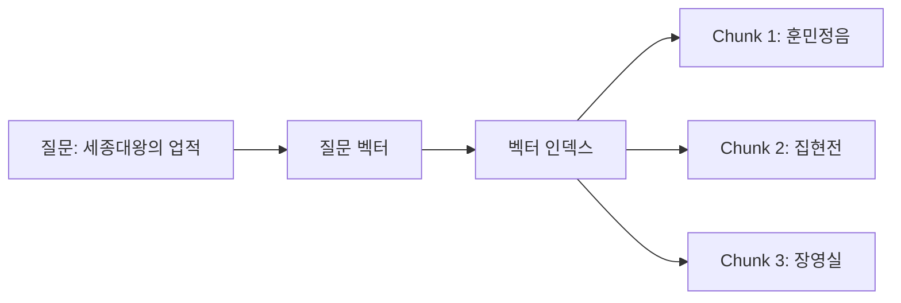

# 07-02. 벡터 인덱스 만들기

Source: <https://wikidocs.net/319224>

## 핵심 요약

벡터 인덱스는 `Chunk.embedding` 같은 벡터 속성을 빠르게 검색하기 위한 Neo4j 인덱스입니다.
질문도 같은 임베딩 모델로 벡터화한 뒤, 인덱스에서 가장 가까운 청크를 Top-K로 가져옵니다.

## 벡터 인덱스의 세 가지 핵심 조건

| 조건 | 왜 중요한가 |
| --- | --- |
| 같은 임베딩 모델 | 문서 벡터와 질문 벡터가 같은 공간에 있어야 비교할 수 있습니다. |
| 같은 차원 수 | 인덱스 설정의 `vector.dimensions`와 실제 벡터 길이가 같아야 합니다. |
| 적절한 유사도 함수 | OpenAI 같은 일반 텍스트 임베딩은 보통 `cosine`을 사용합니다. |

## Chapter 예시와 이 프로젝트의 Cypher 예시 차이

원문은 Python으로 OpenAI 임베딩을 생성해 `Chunk` 노드에 저장하는 흐름을 보여줍니다.
이 프로젝트의 `cypher/07_02_vector_index.cypher`는 Neo4j Browser에서 바로 실행해 볼 수 있도록 4차원 장난감 벡터를 사용합니다.

| 항목 | 원문 Python 실습 | 이 프로젝트 Cypher 실습 |
| --- | --- | --- |
| 임베딩 생성 | OpenAI API 호출 | 손으로 만든 4차원 숫자 배열 |
| 벡터 차원 | 보통 1536차원 | 4차원 |
| 목적 | 실제 RAG 준비 | 벡터 인덱스 문법과 흐름 이해 |
| API 비용 | 발생 가능 | 없음 |

## 기본 Cypher 흐름

### 1. 연습 데이터 생성

```cypher
MERGE (c:Chunk:PracticeChapter07 {id: "ch07-c1"})
SET c.text = "세종대왕은 백성을 위해 훈민정음을 창제했다.",
    c.source = "chapter07_practice",
    c.embedding = [0.90, 0.10, 0.20, 0.00];
```

### 2. 벡터 인덱스 생성

```cypher
CREATE VECTOR INDEX practice_ch07_chunk_embeddings IF NOT EXISTS
FOR (c:Chunk) ON (c.embedding)
OPTIONS { indexConfig: {
  `vector.dimensions`: 4,
  `vector.similarity_function`: 'cosine'
} };
```

실제 OpenAI `text-embedding-3-small` 기본 임베딩을 쓴다면 `vector.dimensions`는 1536에 맞춰야 합니다.

### 3. 인덱스 상태 확인

```cypher
SHOW VECTOR INDEXES YIELD name, state, populationPercent
WHERE name = 'practice_ch07_chunk_embeddings'
RETURN name, state, populationPercent;
```

`state`가 `ONLINE`인지 확인한 뒤 검색합니다.

### 4. 벡터 검색

원문 및 Neo4j 2025.x 스타일은 다음 프로시저를 사용합니다.

```cypher
CALL db.index.vector.queryNodes(
  'practice_ch07_chunk_embeddings',
  3,
  [0.86, 0.14, 0.24, 0.04]
)
YIELD node, score
RETURN node.id AS id, node.text AS text, score
ORDER BY score DESC;
```

Neo4j 2026 계열을 사용한다면 `SEARCH` 절이 선호될 수 있습니다. 버전을 먼저 확인하세요.

```cypher
CALL dbms.components() YIELD versions
RETURN versions[0] AS neo4j_version;
```

## Python 구현을 나중에 만든다면

이번 작업에서는 `src/`를 수정하지 않습니다. 나중에 직접 Python 파일을 만들 때는 다음 책임으로 나누면 좋습니다.

| 예상 파일 | 역할 |
| --- | --- |
| `src/07_02_prepare_chunks.py` | 문서 청크 생성, 임베딩 생성, `Chunk` 저장 |
| `src/07_02_query_vector_index.py` | 질문 임베딩 후 벡터 인덱스 검색 |

프로젝트 규칙상 `.env` 로딩과 Neo4j 설정은 `src/util.py`의 공통 헬퍼를 재사용하는 편이 좋습니다.

## 흔한 실수

- 1536차원 인덱스를 만들고 4차원 테스트 벡터로 검색하는 것
- 인덱스 이름을 Python 코드와 Cypher에서 다르게 쓰는 것
- `Chunk` 노드 일부에만 `embedding` 속성이 있어 결과가 예상보다 적게 나오는 것
- 기존 실습 데이터를 지우려고 `MATCH (c:Chunk) DELETE c`처럼 너무 넓은 삭제 쿼리를 쓰는 것
- 벡터 인덱스는 관계를 탐색하지 않는다는 점을 잊는 것: 관계 확장은 7-3의 Cypher/Retriever 단계입니다.

**다이어그램: 벡터 인덱스 검색은 질문 벡터와 Chunk 벡터의 가까움을 비교합니다.**


