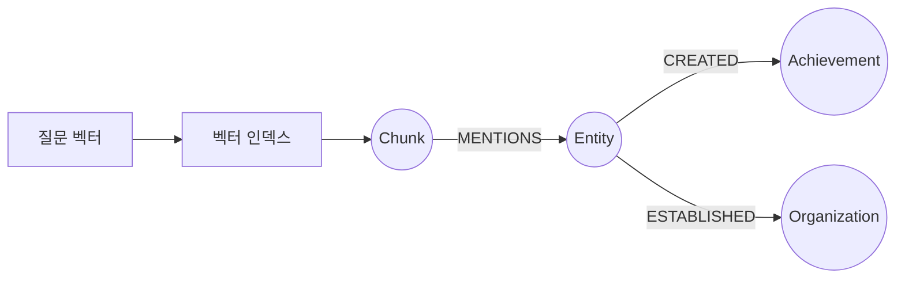

# 07-03. 그래프+벡터 검색 결합

Source: <https://wikidocs.net/319225>

## 핵심 요약

7-2에서 배운 벡터 검색은 “질문과 비슷한 청크”를 찾습니다.
7-3의 핵심은 그 청크에서 멈추지 않고, `MENTIONS` 관계를 따라 엔티티와 주변 관계까지 확장하는 것입니다.

즉 검색 결과가 다음처럼 바뀝니다.

| 단계 | 가져오는 컨텍스트 |
| --- | --- |
| 벡터 검색만 | 관련 청크 텍스트 |
| 벡터 + 그래프 | 관련 청크 텍스트 + 언급된 엔티티 + 엔티티 주변 관계 |
| 하이브리드 + 그래프 | 의미 검색 + 키워드 검색 + 그래프 관계 |

## VectorCypherRetriever의 사고방식

1. 벡터 검색으로 `node`라는 `Chunk` 후보를 찾습니다.
2. `score`라는 유사도 점수가 함께 생깁니다.
3. 사용자가 작성한 Cypher 조각이 `node`에서 시작해 그래프를 확장합니다.
4. 최종 `RETURN` 결과가 LLM에 전달할 컨텍스트가 됩니다.

```cypher
OPTIONAL MATCH (node)-[:MENTIONS]->(entity)
OPTIONAL MATCH (entity)-[r]->(related)
RETURN node.text AS chunk_text,
       score,
       collect(DISTINCT entity.name) AS mentioned_entities,
       collect(DISTINCT {from: entity.name, rel: type(r), to: related.name}) AS relationships
```

**다이어그램: VectorCypherRetriever는 벡터로 Chunk를 찾은 뒤 그래프를 확장합니다.**



## HybridRetriever와 RRF

`HybridRetriever`는 벡터 검색과 전문 검색을 함께 사용합니다.

- 벡터 검색: 의미가 비슷한 문장을 잘 찾습니다.
- 전문 검색: 정확한 단어가 들어간 문장을 잘 찾습니다.
- RRF(Reciprocal Rank Fusion): 두 검색 결과의 순위를 합쳐 최종 순위를 정합니다.

예를 들어 “훈민정음 창제”처럼 특정 키워드가 중요하면서도 의미 검색도 필요한 질문은 하이브리드 검색이 유리합니다.

## Retriever 선택 가이드

| 상황 | 추천 Retriever | 이유 |
| --- | --- | --- |
| 단순히 관련 문단을 찾고 싶음 | `VectorRetriever` | 구조가 가장 단순합니다. |
| 관련 문단 주변의 엔티티/관계도 필요함 | `VectorCypherRetriever` | GraphRAG 핵심 패턴입니다. |
| 정확한 키워드가 중요함 | `HybridRetriever` | 벡터 검색이 놓치는 고유명사를 보완합니다. |
| 키워드, 의미, 관계가 모두 중요함 | `HybridCypherRetriever` | 가장 풍부하지만 구성도 가장 복잡합니다. |

## 컨텍스트 확장 패턴

### 1단계 확장

청크가 직접 언급한 엔티티와, 그 엔티티가 직접 연결된 노드를 가져옵니다.

```cypher
OPTIONAL MATCH (node)-[:MENTIONS]->(entity)
OPTIONAL MATCH (entity)-[r]->(related)
RETURN node.text, entity.name, type(r), related.name;
```

### 2단계 확장

엔티티에서 1~2홉까지 연결된 경로를 가져옵니다.

```cypher
OPTIONAL MATCH (node)-[:MENTIONS]->(entity)
OPTIONAL MATCH path = (entity)-[*1..2]-(connected)
RETURN node.text,
       [n in nodes(path) | n.name] AS path_nodes,
       [r in relationships(path) | type(r)] AS path_rels;
```

2단계 확장은 더 풍부하지만 노이즈가 늘어날 수 있습니다. 학습 단계에서는 먼저 1단계 확장을 확인한 뒤 넓히는 편이 좋습니다.

### 특정 관계만 확장

질문 의도가 명확하면 관계 유형을 제한합니다.

```cypher
OPTIONAL MATCH (node)-[:MENTIONS]->(entity)
OPTIONAL MATCH (entity)-[r:CREATED|INVENTED]->(achievement)
RETURN node.text, entity.name, type(r), achievement.name;
```

## `cypher/07_03_graph_vector_retrieval.cypher`에서 확인할 것

이 파일은 Python Retriever 대신 Cypher만으로 같은 아이디어를 재현합니다.

1. 4차원 장난감 임베딩이 있는 `Chunk`를 만듭니다.
2. `MENTIONS` 관계로 Chapter 6과 비슷한 역사 엔티티를 연결합니다.
3. 벡터 인덱스와 전문 검색 인덱스를 만듭니다.
4. 벡터 검색 결과를 `MENTIONS` 관계로 확장합니다.
5. 전문 검색과 벡터 검색 결과를 비교합니다.
6. 관계 유형을 제한하거나 2홉까지 확장해 컨텍스트 차이를 관찰합니다.

## 흔한 실수

- `retrieval_query`에서 `node`가 이미 검색된 `Chunk`라는 점을 잊는 것
- 그래프 확장 쿼리가 너무 넓어져 질문과 무관한 관계까지 가져오는 것
- `OPTIONAL MATCH`를 `MATCH`로 바꿔 관계가 없는 청크가 모두 탈락하는 것
- `HybridRetriever`를 쓰면서 fulltext index를 만들지 않는 것
- 결과를 LLM에 넘길 때 텍스트, 엔티티, 관계를 구분하지 않아 프롬프트가 지저분해지는 것

## 복습 질문

1. 벡터 검색 결과의 `score`는 무엇을 의미하나요?
2. `MENTIONS` 관계가 없다면 GraphRAG에서 어떤 단계가 막히나요?
3. 1단계 확장과 2단계 확장의 장단점은 무엇인가요?
4. “장영실이 발명한 과학 기구”는 왜 단순 벡터 검색보다 그래프 확장이 유리할 수 있나요?
5. 정확한 키워드와 의미 검색이 모두 중요할 때 어떤 Retriever가 적절한가요?
