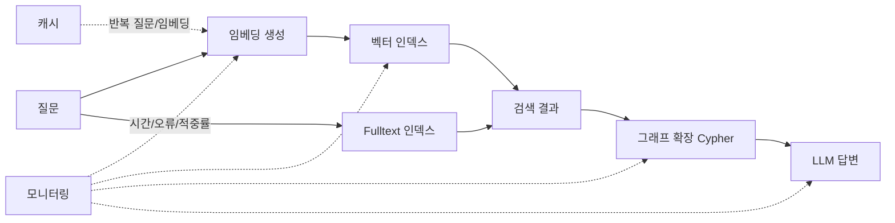
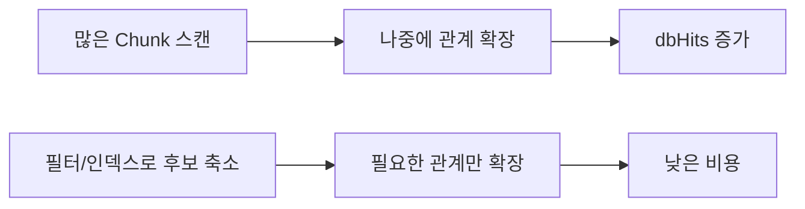

# 08-04. 성능 최적화

Source: <https://wikidocs.net/319232>

## 핵심 요약

GraphRAG가 작게 동작할 때는 “검색이 되는가?”가 중요하지만, 데이터가 늘어나면 “얼마나 빠르고 안정적으로 검색되는가?”가 중요해집니다.
8-4는 인덱스, 쿼리 계획, 배치 처리, 캐싱, 모니터링을 통해 GraphRAG 시스템의 속도와 비용을 관리하는 방법을 다룹니다.

## 최적화 대상 한눈에 보기

| 대상 | 왜 중요한가 | 대표 점검 방법 |
| --- | --- | --- |
| 벡터 인덱스 | 의미 검색 속도와 recall에 직접 영향 | `SHOW VECTOR INDEXES`, Top-K 결과 확인 |
| Fulltext 인덱스 | 고유명사/키워드 검색 보완 | `SHOW FULLTEXT INDEXES`, 키워드 검색 결과 확인 |
| 속성 인덱스 | `source`, `created_at`, `type` 같은 필터 속도 개선 | `SHOW INDEXES`, `EXPLAIN` |
| Cypher 쿼리 | 불필요한 스캔/카테시안 곱 방지 | `EXPLAIN`, `PROFILE` |
| 배치 처리 | 임베딩 생성/API 비용/업로드 시간을 안정화 | batch size, retry, rate limit |
| 캐싱 | 반복 질문/반복 임베딩 비용 절감 | cache hit rate, TTL |
| 모니터링 | 느려지는 지점을 조기에 발견 | 평균 응답 시간, 오류 수, 캐시 적중률 |

**다이어그램: GraphRAG 성능 최적화의 주요 관찰 지점입니다.**



## Neo4j 인덱스 최적화

### 벡터 인덱스

프로젝트의 기본 `Chunk.embedding` 인덱스는 다음 형태입니다.

```cypher
CREATE VECTOR INDEX chunk_embeddings IF NOT EXISTS
FOR (c:Chunk) ON (c.embedding)
OPTIONS { indexConfig: {
  `vector.dimensions`: 1536,
  `vector.similarity_function`: 'cosine'
} };
```

벡터 인덱스 튜닝에서 가장 헷갈리는 값은 HNSW 파라미터입니다.

| 설정 | 의미 | 트레이드오프 |
| --- | --- | --- |
| `vector.hnsw.m` | HNSW 그래프에서 노드당 연결 수 | 높을수록 recall 가능성 증가, 메모리 증가 |
| `vector.hnsw.ef_construction` | 인덱스 구축 중 탐색 후보 수 | 높을수록 인덱스 품질 증가, 구축 시간 증가 |
| `vector.quantization.enabled` | 벡터 저장/검색 최적화 | 저장 공간 절약, 약간의 정확도 손실 가능 |

> 주의: 이미 같은 라벨/속성에 인덱스가 있다면 같은 스키마의 최적화 인덱스를 추가로 만들기보다, 별도 실험 라벨에서 비교하거나 기존 인덱스를 계획적으로 재생성하세요.

### Fulltext 인덱스

현재 튜토리얼 `Chunk`는 `content`가 아니라 `text` 속성을 사용합니다. 따라서 원문 예시를 이 프로젝트에 맞추면 다음처럼 씁니다.

```cypher
CREATE FULLTEXT INDEX chunk_fulltext IF NOT EXISTS
FOR (c:Chunk) ON EACH [c.text];
```

한국어 검색에서는 조사/어미 때문에 `"세종대왕의 업적"`이 `"세종대왕"`과 기대처럼 매칭되지 않을 수 있습니다. 이때는 쿼리 확장, HyDE, 또는 키워드 전처리가 도움이 됩니다.

### 속성 인덱스

필터에 자주 쓰는 속성은 인덱스를 둡니다.

```cypher
CREATE INDEX chunk_source IF NOT EXISTS
FOR (c:Chunk) ON (c.source);
```

예를 들어 `WHERE c.source = $source`를 자주 쓰면 `source` 인덱스가 후보를 줄여 줍니다.

## 쿼리 최적화

### `EXPLAIN`과 `PROFILE`

| 명령 | 실제 실행 여부 | 용도 |
| --- | --- | --- |
| `EXPLAIN` | 실행하지 않음 | 실행 계획을 안전하게 확인 |
| `PROFILE` | 실제 실행 | 실제 row 수와 dbHits를 확인 |

처음에는 `EXPLAIN`으로 계획을 확인하고, read-only 쿼리일 때만 `PROFILE`로 실제 비용을 봅니다.

```cypher
EXPLAIN
MATCH (c:Chunk)-[:MENTIONS]->(e)
WHERE c.source = "korean_history.txt"
RETURN c.text, e.name
LIMIT 20;
```

### 피해야 할 패턴

```cypher
MATCH (c:Chunk)
WHERE c.embedding IS NOT NULL
WITH c
MATCH (c)-[:MENTIONS]->(e)
RETURN c, collect(e);
```

위 쿼리는 먼저 많은 `Chunk`를 훑은 뒤 관계를 확장할 수 있습니다. 더 좋은 시작점은 관계 패턴과 필터를 함께 두고, 필요한 경우 `LIMIT`를 일찍 둡니다.

```cypher
MATCH (c:Chunk)-[:MENTIONS]->(e)
WHERE c.embedding IS NOT NULL
RETURN c.text, collect(e.name) AS entities
LIMIT 100;
```

**다이어그램: 좋은 쿼리는 후보를 먼저 줄인 뒤 관계를 확장합니다.**



## 페이지네이션

`SKIP` 기반 페이지네이션은 작은 데이터에서는 괜찮지만, 큰 데이터에서는 앞 페이지를 계속 건너뛰는 비용이 커집니다.

학습 단계에서는 다음처럼 Top-K를 넉넉히 가져온 뒤 페이지를 나눌 수 있습니다.

```cypher
CALL db.index.vector.queryNodes('chunk_embeddings', $top_k, $embedding)
YIELD node, score
RETURN node.id AS id, node.text AS text, score
ORDER BY score DESC
SKIP $skip
LIMIT $limit;
```

대규모 서비스에서는 커서 기반 페이지네이션이나 `score`/`id` 조합을 이용한 keyset 방식도 검토합니다.

## 배치 처리

### 임베딩 생성

- 너무 큰 요청은 실패/타임아웃 가능성이 커집니다.
- 너무 작은 요청은 API 왕복 비용이 커집니다.
- 실패 시 바로 중단하지 말고 재시도와 지수 백오프를 둡니다.

권장 사고방식:

```text
문서 목록 → 50~100개 단위 batch → 임베딩 생성 → 실패 시 재시도 → Neo4j 배치 업로드
```

### Neo4j 업로드

`CREATE`를 한 건씩 반복하기보다 `UNWIND $chunks AS chunk`로 묶어 넣는 편이 좋습니다. 재실행 가능성이 있는 튜토리얼 데이터는 `CREATE`보다 `MERGE`를 검토합니다.

## 캐싱 전략

### 임베딩 캐싱

동일한 텍스트의 임베딩은 매번 다시 만들 필요가 없습니다.

| 캐시 대상 | 효과 |
| --- | --- |
| 문서 청크 임베딩 | 인덱싱 재실행 비용 감소 |
| 질문 임베딩 | 반복 질문/테스트 비용 감소 |
| 검색 결과 | 동일 질문의 응답 속도 개선 |

주의할 점:

- 임베딩 모델이 바뀌면 캐시 키에 모델명을 포함하세요.
- 검색 결과 캐시는 데이터가 바뀌면 오래된 결과를 줄 수 있으므로 TTL을 둡니다.

## 성능 모니터링

최소한 아래 값은 실험 로그에 남기면 좋습니다.

| 지표 | 의미 |
| --- | --- |
| 평균 검색 시간 | 검색 파이프라인이 느려지는지 확인 |
| LLM 호출 시간 | 답변 생성이 병목인지 확인 |
| 캐시 적중률 | 캐시가 실제로 도움이 되는지 확인 |
| 오류 수 | API/DB 장애 또는 타임아웃 추적 |
| Top-K 결과 품질 | 빠르지만 품질이 낮은 최적화를 방지 |

## 흔한 실수

- 벡터 인덱스가 `ONLINE`이 되기 전에 검색하는 것
- `Chunk.text`를 쓰는 프로젝트에서 원문 예시의 `Chunk.content`를 그대로 쓰는 것
- `PROFILE`을 쓰기 쿼리에 무심코 적용하는 것
- `SKIP`이 큰 페이지네이션을 대량 데이터에 계속 사용하는 것
- 임베딩 모델을 바꿨는데 기존 임베딩/인덱스/캐시를 그대로 쓰는 것
- 성능만 보고 retrieval 품질 평가를 같이 보지 않는 것

## 복습 질문

1. `EXPLAIN`과 `PROFILE`의 차이는 무엇인가요?
2. 벡터 인덱스의 `m` 값을 높이면 어떤 장단점이 있나요?
3. 한국어 fulltext 검색에서 쿼리 확장이 도움이 되는 이유는 무엇인가요?
4. 임베딩 캐시에 모델명을 포함해야 하는 이유는 무엇인가요?
5. 검색 속도 최적화와 검색 품질 평가는 왜 함께 봐야 하나요?
